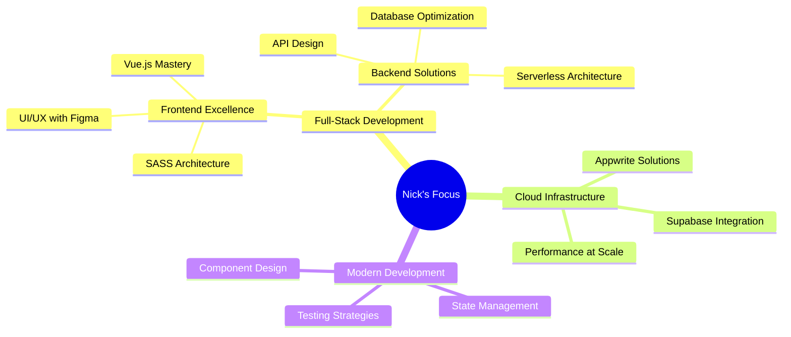

<div align="center">

  |  |  |  |
| --- | --- | --- |

  

  <!-- You can use a custom animated GIF or SVG here for more effects -->
  

  

  <br>

  [](https://github.com/ngou1200)
  [](https://github.com/ngou1200)
  [](https://twitter.com/benhan871986)

</div>

<div align="center">

```typescript
const nick = {
    fullName: "Ngo Huu Loc",
    location: "Vietnam 🇻🇳",
    languages: ["Vietnamese", "English (GB & US)"],
    type: "Full-Stack Developer",
    lastActive: "12:39 PM on June 20, 2025",
    motto: "Choose to become extraordinary",
    expertise: ["Web Development", "UI/UX Design"],
    contact: {
        github: "ngou1200",
        twitter: "benhan871986"
    }
};
```
</div>

---

### 🚀 Technology Stack

<details open>
<summary><b>🎨 Frontend & Design</b></summary>
<br>

<div align="center">

| Category | Technologies |
|----------|-------------|
| **Core** |    |
| **Frameworks** |   |
| **Styling** |   |
| **Design** |  |

</div>
</details>

<details open>
<summary><b>⚡ Backend & Infrastructure</b></summary>
<br>

<div align="center">

| Category | Technologies |
|----------|-------------|
| **Runtime & Languages** |  |
| **Backend as a Service** |   |
| **Tools** | 

</div>
</details>

<details open>
<summary><b>📊 Skill Proficiency</b></summary>
<br>

<div align="center">

```text
Frontend Development    ████████████████████░   95%
Backend Development    ████████████████████░   90%
UI/UX Design          ███████████████████░░   85%
```

</div>
</details>

---

### 📈 GitHub Statistics

<div align="center">
  
  
</div>

<div align="center">
  
</div>

<div align="center">
  
</div>

---

### 🎯 Current Focus & Learning Path

<div align="center">



</div>

---

### 💭 Favorite Quote

<div align="center">

> *"I think it is absolutely possible for an ordinary person to choose to become extraordinary"*
> 
> \- Elon Musk

</div>

---

### 📫 Connect With Me

<div align="center">
  <a href="https://github.com/ngou1200" target="_blank">
    
  </a>
  <a href="https://twitter.com/benhan871986" target="_blank">
    
  </a>
</div>

---

<div align="center">
  
</div>

<div align="center">
  <b>Last Updated: 2025-06-20 12:39:40 UTC</b>
  
  
</div>
