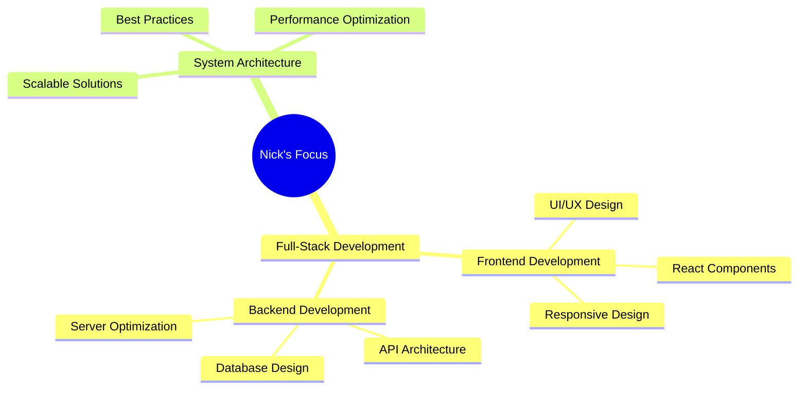

<div align="center">
  
</div>

<div align="center">
  
</div>

<div align="center">
  
[](https://github.com/ngou1200)
[](https://github.com/ngou1200)
[](https://twitter.com/benhan871986)

</div>

<div align="center">
  
```typescript
const nick = {
    fullName: "Ngo Huu Loc",
    location: "Vietnam 🇻🇳",
    languages: ["Vietnamese", "English (GB & US)"],
    type: "Full-Stack Developer",
    lastActive: "9:32 AM on May 21, 2025",
    motto: "Choose to become extraordinary",
    contact: {
        github: "ngou1200",
        twitter: "ngou1200"
    }
};
```

</div>

---

### 🧰 Technology Arsenal

<details open>
<summary><b>🔧 Core Technologies</b></summary>
<br>

<div align="center">

| Category | Technologies |
|----------|-------------|
| **Frontend** |     |
| **Backend** |    |
| **Tools** |    |

</div>
</details>

<details open>
<summary><b>📊 Skill Proficiency</b></summary>
<br>

<div align="center">

```text
Frontend Development    ████████████████████░   95%
Backend Development    ████████████████████░   90%
System Design          ███████████████░░░░░░   75%
Database Management    ██████████████░░░░░░░   70%
```

</div>
</details>

---

### 📈 GitHub Statistics

<div align="center">
  
  
</div>

<div align="center">
  
</div>

<div align="center">
  
</div>

---

### 🌟 Featured Repositories

<div align="center">

[](https://github.com/ngou1200/ngou1200)

</div>

---

### 🎯 Current Focus

<div align="center">



</div>

---

### 💭 Favorite Quote

<div align="center">

> *"I think it is absolutely possible for an ordinary person to choose to become extraordinary"*
> 
> \- Elon Musk

</div>

---

### 📫 Connect With Me

<div align="center">
  <a href="https://github.com/ngou1200" target="_blank">
    
  </a>
  <a href="https://twitter.com/benhan871986" target="_blank">
    
  </a>
</div>

---

<div align="center">
  
</div>

<div align="center">
  <b>Last Updated: 2025-05-21 03:17:19 UTC</b>
  
  
</div>

<!-- 
Repository Structure:
└── 📁 ngou1200
    └── 📄 README.md

Maintenance Tips:
1. Update skills and proficiency regularly
2. Keep GitHub stats current
3. Add new projects as they're completed
4. Maintain active GitHub contributions
-->
